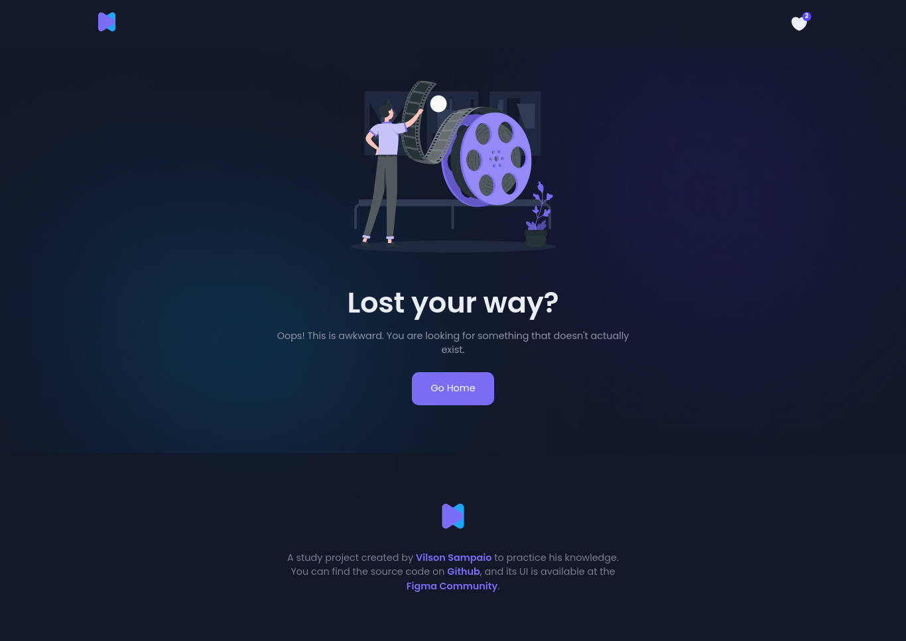

<h1 align="center">
  
</h1>

🬠Discover movies and rate your favorites.

  

  

  

  

## 📌 Table of Content

- [📌 Table of Content](#-table-of-content)
- [📝 About the project](#-about-the-project)
- [✨ Features](#-features)
- [🖥 Screens](#-screens)
- [👷 Installation](#-installation)
- [📮 FAQ](#-faq)
- [📕 License](#-license)

## 📝 About the project

OnFlix is a platform that allows the discovery and management of movies, categorizing them as favorites.

This is a study project focused on putting into practice my knowledge obtained throughout my education as a Front-end Developer.
  * **Status**: ✅ Done.

## ✨ Features
- [x] 📽 Filtering of the best selling or most profitable movies, plus information on a specific movie.
- [x] 💟 Management of favorite movies.
- [x] 🔎 Movie search.

## 🖥 Screens
**Home**

**Movie**

**Search**

**Favorites**

**Not Found**

## 👷 Installation
1. First, you need to have [NodeJS](https://nodejs.org/en/docs/) and [Yarn](https://yarnpkg.com/getting-started) installed on your computer.

2. With the programs listed above installed, clone this repository: `git clone https://github.com/vilsonsampaio/onflix.git`.

3. Inside the project directory, install all the application dependencies: `yarn add`.

4. Clone the `.env.example` file to set the environment variables: `cp .env.example .env`. 
   1. You will need an account at [The Movie Database](https://www.themoviedb.org/) to provide the API key so that you can make requests to the TMDB server.

5. Run the application with `yarn start`, and the platform will be running at `http://localhost:3000/`.

## 📮 FAQ
**Question:** What technologies were used in this project?

**Answer:** This project used [Create React App](https://create-react-app.dev/) as a boilerplate for [ReactJS](https://reactjs.org/) to create the interface along with [Styled Components](https://styled-components.com/) for styling the components. Additionally, [Axios](https://axios-http.com/) was used as HTTP client, [chroma.js](https://gka.github.io/chroma.js/) for color manipulation, and [React Toastify](https://fkhadra.github.io/react-toastify/introduction/) for displaying messages to the user. As IDE, [Visual Studio Code](https://code.visualstudio.com/#alt-downloads) was used.

**Question**: Who designed the screens?

**Answer:** The application UI were created by [Pramod Poudel](https://pramodpoudel.com.np/) and are available at [Figma Community](https://www.figma.com/community/file/1054327700155381422).

## 📕 License

Developed in 2022. 
This project is under the [MIT License](https://github.com/vilsonsampaio/onflix/blob/main/LICENSE).

---

<h4 align="center">
  Made with 💙 <a href="https://www.linkedin.com/in/vilsonsampaio/" target="_blank">Vilson Sampaio</a>
</h4>